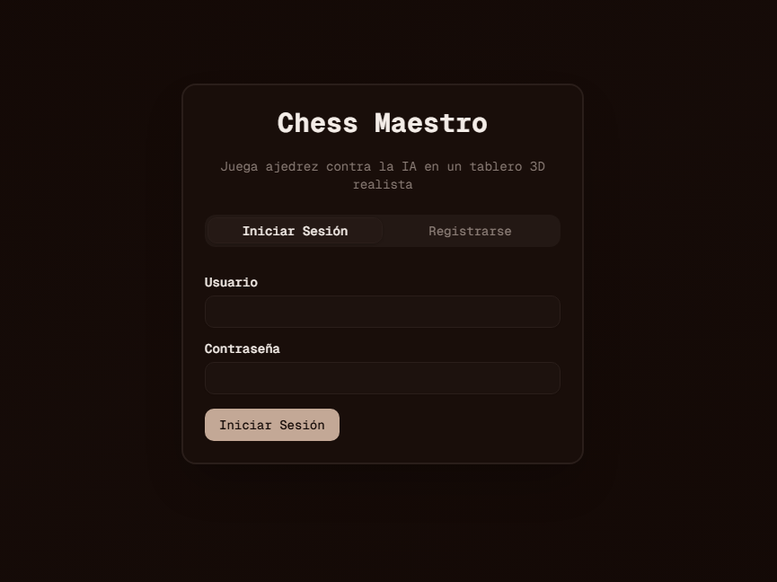
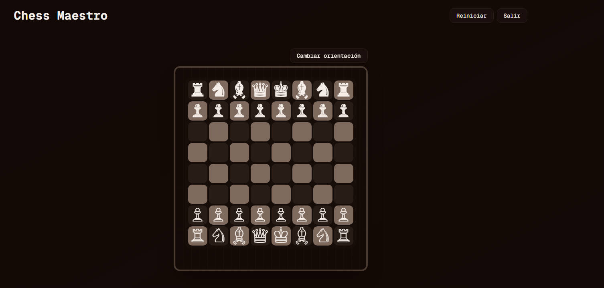

## README.md

# ♟️ Chess Maestro






Chess Maestro es una aplicación completa de ajedrez que combina un **frontend moderno en Next.js** con un **backend robusto en FastAPI**. Permite jugar contra una **IA basada en Minimax**, con autenticación de usuarios y un tablero interactivo que se actualiza dinámicamente a partir de notación FEN.

---

## 🚀 Características

- **Frontend (Next.js + React + TailwindCSS)**
  - Tablero interactivo con renderizado desde FEN.
  - Orientación configurable (blancas abajo/negras abajo).
  - Restricción de movimientos según el turno.
  - Panel lateral con estado del juego (FEN, turno, resultado).
  - Autenticación JWT (login/registro).

- **Backend (FastAPI + python-chess)**
  - Endpoints REST: `/state`, `/move`, `/reset`.
  - Motor de ajedrez con IA Minimax configurable en profundidad.
  - Autenticación segura con JWT.
  - Respuestas JSON con FEN y turno (`w` / `b`).

---

## 📂 Estructura del proyecto

```
Chess/
├── frontend/        # Next.js + React
│   ├── app/         # Páginas y layout
│   ├── components/  # ChessBoard, ChessGame, LoginPage, UI
│   └── ...
├── backend/         # FastAPI + python-chess
│   ├── chess/       # Lógica de juego (minmax, utils)
│   ├── auth/        # Autenticación JWT
│   └── main.py      # Punto de entrada FastAPI
└── README.md
```

---

## ⚙️ Instalación

### 1. Clonar el repositorio
```bash
git clone https://github.com/xcaim04/Chess.git
cd Chess
```

### 2. Backend (FastAPI)
```bash
cd backend
python -m venv .venv
source .venv/bin/activate   # Linux/Mac
.venv\Scripts\activate      # Windows

pip install -r requirements.txt
uvicorn main:app --reload
```

El backend quedará disponible en `http://localhost:8000`.

### 3. Frontend (Next.js)
```bash
cd frontend
npm install
npm run dev
```

El frontend quedará disponible en `http://localhost:3000`.

---

## 🔑 Endpoints principales

- `GET /chess/state` → Estado actual del tablero (FEN, turno, resultado).  
- `POST /chess/move` → Realiza un movimiento humano y luego la IA responde.  
- `POST /chess/reset` → Reinicia la partida.  

Ejemplo de respuesta de `/chess/state`:
```json
{
  "fen": "rnbqkbnr/pppppppp/8/8/8/8/PPPPPPPP/RNBQKBNR w KQkq - 0 1",
  "turn": "w",
  "game_over": false,
  "result": null
}
```

---

## 🛠️ Tecnologías

- **Frontend:** Next.js, React, TailwindCSS  
- **Backend:** FastAPI, python-chess  
- **Autenticación:** JWT  
- **IA:** Minimax con profundidad configurable  

---

## 📜 Licencia

Este proyecto está bajo la licencia MIT. Puedes usarlo, modificarlo y distribuirlo libremente.

---

## 👨‍💻 Autor

Desarrollado por **Carlos Blanco**  
Desarrollador de software y apasionado de la **Inteligencia Artificial**, creando soluciones que combinan rigor técnico con experiencias interactivas y accesibles.
